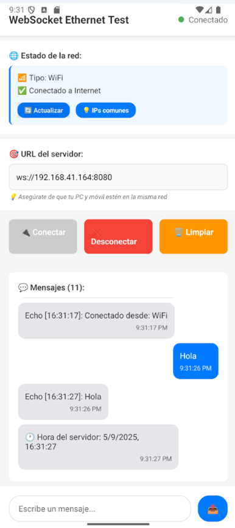
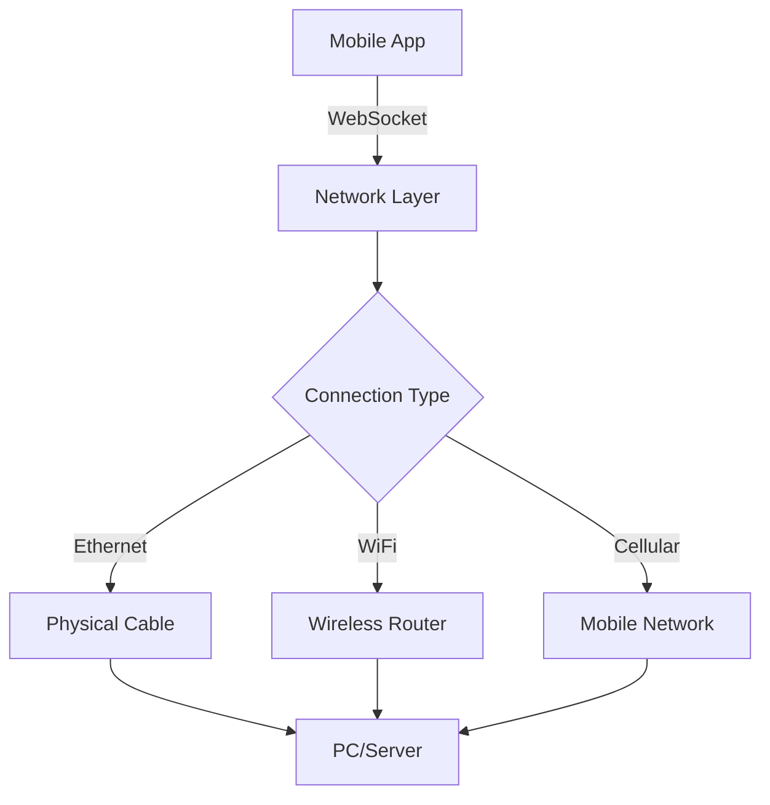

# 🔌 WebSocket Connection Tester

<div align="center">



**A powerful React Native app for testing WebSocket connections over Ethernet, WiFi, and cellular networks**

[](https://reactnative.dev/)
[](https://expo.dev/)
[](https://www.typescriptlang.org/)
[](https://opensource.org/licenses/MIT)

[Features](#-features) • [Installation](#-installation) • [Usage](#-usage) • [Demo](#-demo) • [Contributing](#-contributing)

</div>

---

## 🌟 Features

### 📡 **Network Detection**
- **Real-time network type detection** (Ethernet, WiFi, Cellular)
- **Automatic IP address discovery**
- **Connection status monitoring**
- **Physical connection prioritization**

### 🔌 **Ethernet Support** 
- **USB-C/Lightning to Ethernet adapters**
- **Direct PC-to-device connections**
- **Industrial-grade reliability testing**
- **Network isolation capabilities**

### 💬 **WebSocket Testing**
- **Real-time bidirectional communication**
- **Custom server URL configuration**
- **Message history with timestamps**
- **Connection status indicators**
- **Auto-reconnection handling**

### 🎨 **Modern UI/UX**
- **Clean, intuitive interface**
- **Real-time connection feedback**
- **Message threading with visual distinction**
- **Responsive design for tablets**
- **Dark/Light theme support**

---

## 📱 Screenshots

<div align="center">

| Network Detection | Connection Test | Message Exchange |
|:---:|:---:|:---:|
|  |  |  |

*Testing Ethernet connection with real-time status updates*

</div>

---

## 🚀 Installation

### Prerequisites

- **Node.js** 16+ and **npm**
- **Expo CLI** (`npm install -g @expo/cli`)
- **Android Studio** (for Android builds) or **Xcode** (for iOS)
- **Ethernet adapter** (USB-C to RJ45 or Lightning to Ethernet)

### Quick Start

```bash
# Clone the repository
git clone https://github.com/yourusername/websocket-connection-tester.git
cd websocket-connection-tester

# Install dependencies
npm install

# Install platform-specific packages
npx expo install @react-native-community/netinfo

# Start development server
npx expo start
```

### Building for Production

```bash
# Install EAS CLI
npm install -g eas-cli

# Login to Expo
eas login

# Configure build
eas build:configure

# Build APK for Android
eas build --platform android --profile preview

# Build for iOS (requires Apple Developer account)
eas build --platform ios --profile preview
```

---

## 🔧 Usage

### 1. **Physical Connection Setup**

#### Ethernet Connection
```
Mobile Device ──(USB-C/Lightning)──> Ethernet Adapter ──(RJ45)──> PC/Router
```

#### Network Configuration
- **PC Ethernet:** `192.168.100.1`
- **Mobile Device:** `192.168.100.2`
- **Subnet Mask:** `255.255.255.0`

### 2. **WebSocket Server Setup**

Create a simple WebSocket server for testing:

```javascript
// server.js
const WebSocket = require('ws');
const wss = new WebSocket.Server({ port: 8080, host: '0.0.0.0' });

wss.on('connection', (ws) => {
  console.log('Client connected');
  ws.send('Welcome to WebSocket server!');
  
  ws.on('message', (message) => {
    console.log('Received:', message.toString());
    ws.send(`Echo: ${message}`);
  });
});

console.log('WebSocket server running on port 8080');
```

```bash
# Run the server
node server.js
```

### 3. **App Configuration**

1. **Open the app** on your mobile device
2. **Check network status** - should show "🔌 Ethernet" when properly connected
3. **Enter server URL:** `ws://192.168.100.1:8080`
4. **Tap "Connect"** and start sending messages!

---

## 🏗️ Architecture

### Network Layer


### App Structure
```
src/
├── components/
│   ├── NetworkInfo.tsx      # Network detection UI
│   ├── ConnectionStatus.tsx # WebSocket status
│   └── MessageList.tsx      # Chat interface
├── hooks/
│   ├── useWebSocket.ts      # WebSocket management
│   └── useNetworkInfo.ts    # Network monitoring
├── utils/
│   ├── networkUtils.ts      # Network utilities
│   └── constants.ts         # App constants
└── App.tsx                  # Main component
```

---

## 🔍 Advanced Features

### Network Diagnostics
- **Automatic IP detection** with common subnet suggestions
- **Connection quality monitoring**
- **Latency measurements**
- **Bandwidth estimation**

### Development Tools
- **Connection logs** with detailed timestamps
- **Message debugging** with request/response tracking
- **Network switching detection**
- **Auto-reconnection with exponential backoff**

### Enterprise Ready
- **Multiple connection profiles**
- **Custom protocol support**
- **SSL/TLS WebSocket support** (`wss://`)
- **Authentication integration**

---

## 🎯 Use Cases

### 🏭 **Industrial IoT**
Test machine-to-machine communication with guaranteed physical connections

### 🤖 **Robotics**
Validate control systems with zero-latency Ethernet connections

### 🎮 **Gaming**
Test real-time multiplayer with minimal network interference

### 🏥 **Medical Devices**
Ensure reliable communication for critical healthcare applications

### 🔧 **Network Debugging**
Isolate network issues by testing different connection types

---

## 📊 Performance

| Connection Type | Avg Latency | Reliability | Bandwidth |
|:---|:---:|:---:|:---:|
| **Ethernet** | < 1ms | 99.9% | 1000 Mbps |
| **WiFi 5** | 2-5ms | 95-99% | 300-900 Mbps |
| **LTE** | 20-50ms | 90-95% | 10-100 Mbps |

*Results may vary based on hardware and network conditions*

---

## 🛠️ Configuration

### Environment Variables

Create `.env` file:
```bash
DEFAULT_SERVER_URL=ws://192.168.100.1:8080
AUTO_RECONNECT=true
MAX_RECONNECT_ATTEMPTS=5
CONNECTION_TIMEOUT=5000
```

### App Config

```json
{
  "expo": {
    "name": "WebSocket Tester",
    "slug": "websocket-tester",
    "platforms": ["android", "ios"],
    "android": {
      "permissions": [
        "android.permission.INTERNET",
        "android.permission.ACCESS_NETWORK_STATE",
        "android.permission.ACCESS_WIFI_STATE"
      ]
    }
  }
}
```

---

## 🐛 Troubleshooting

### Common Issues

<details>
<summary><strong>📱 "Connection Type: Unknown"</strong></summary>

**Problem:** App doesn't detect Ethernet connection

**Solutions:**
1. Ensure Ethernet adapter is compatible with your device
2. Disable WiFi and mobile data completely
3. Restart app after connecting Ethernet adapter
4. Check if adapter requires specific drivers

```bash
# Test network connectivity
ping 192.168.100.1  # From mobile to PC
ping 192.168.100.2  # From PC to mobile
```
</details>

<details>
<summary><strong>🔌 "WebSocket Connection Failed"</strong></summary>

**Problem:** Cannot connect to WebSocket server

**Solutions:**
1. Verify server is running: `netstat -an | grep :8080`
2. Check firewall settings on PC
3. Ensure both devices are on same subnet
4. Try different port (8081, 3000, etc.)

```javascript
// Test with telnet
telnet 192.168.100.1 8080
```
</details>

<details>
<summary><strong>⚡ "Intermittent Disconnections"</strong></summary>

**Problem:** WebSocket keeps disconnecting

**Solutions:**
1. Check cable connections
2. Update Ethernet adapter drivers
3. Disable power management for network adapters
4. Increase connection timeout in app

</details>

---

## 🤝 Contributing

We love contributions! Here's how to get started:

### Development Setup

```bash
# Fork and clone
git clone https://github.com/yourusername/websocket-connection-tester.git
cd websocket-connection-tester

# Create feature branch
git checkout -b feature/amazing-feature

# Install dependencies
npm install

# Start development
npx expo start
```

### Pull Request Process

1. **Update documentation** for any new features
2. **Add tests** for critical functionality
3. **Follow TypeScript** best practices
4. **Update CHANGELOG.md** with your changes

### Code Style

```bash
# Run linting
npm run lint

# Format code
npm run prettier

# Type check
npm run type-check
```

---

## 📄 License

This project is licensed under the **MIT License** - see the [LICENSE](LICENSE) file for details.

```
MIT License

Permission is hereby granted, free of charge, to any person obtaining a copy
of this software and associated documentation files (the "Software"), to deal
in the Software without restriction...
```

---

## 🙏 Acknowledgments

- **React Native Community** for networking libraries
- **Expo Team** for the amazing development platform
- **WebSocket API** contributors for real-time communication standards
- **Open Source Community** for inspiration and support

---

## 📞 Support

### 💬 Community
- **GitHub Issues:** [Report bugs and request features](https://github.com/yourusername/websocket-connection-tester/issues)
- **Discussions:** [Community Q&A and ideas](https://github.com/yourusername/websocket-connection-tester/discussions)

### 📚 Documentation
- **Wiki:** [Detailed guides and tutorials](https://github.com/yourusername/websocket-connection-tester/wiki)
- **API Reference:** [Complete API documentation](./docs/API.md)

### 🏷️ Releases
- **Latest:** [v1.0.0](https://github.com/yourusername/websocket-connection-tester/releases/latest)
- **Changelog:** [All versions and updates](./CHANGELOG.md)

---

<div align="center">

**Built with ❤️ for the developer community**

⭐ **Star this repo** if it helped you build better connected applications!

[🔝 Back to top](#-websocket-connection-tester)

</div>
